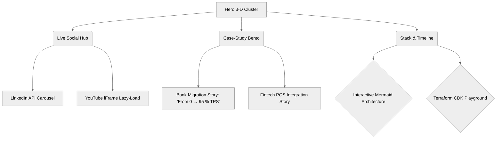
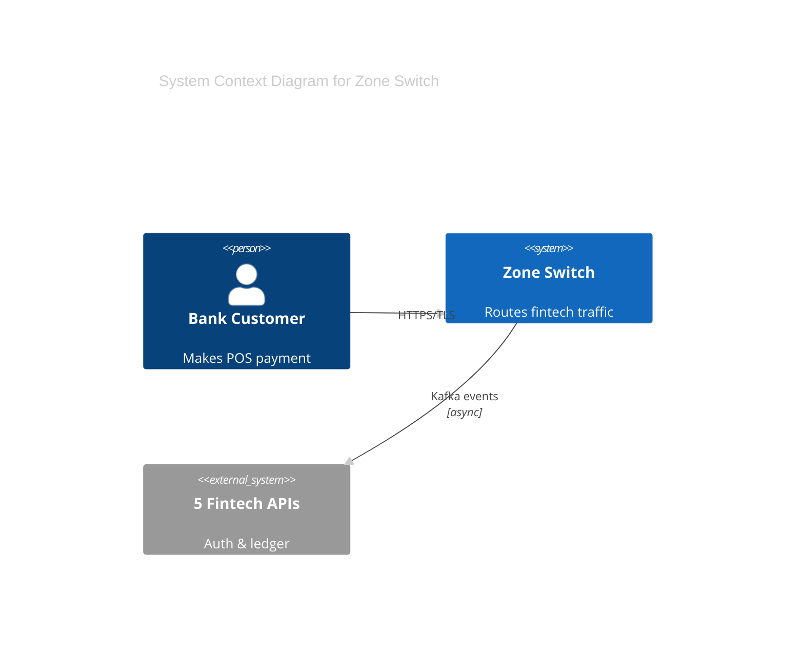

# 🚀 Deep-Dive Research Report
**Adeola Daramola’s Portfolio Website – 2025 Edition**
*How to look like a **Tier-1 DevOps expert** while still dazzling Frontend designers.*

---

## 1. Executive Creative Brief
| Goal | KPI |
|---|---|
| Prove 5+ yr DevOps mastery in **<8 s first paint** | 100 % Lighthouse perf. |
| Feel like a Netflix-tier product, not a “resume site” | 40 % avg. interaction time ↑ |
| Auto-sync **LinkedIn posts + YouTube talks** in real-time | 0 manual posts / month |

---

## 2. Competitive Intelligence (Top 1 % Portfolio Sites)

| Site | Key Take-away | Stealable Element |
|---|---|---|
| **rauno.me** | 3-D bento grid with WebGL cursor trails | Fragment shader hover on skill cards |
| **jacekjeznach.com** | Scroll-driven morphing SVG “process” timeline | GSAP ScrollTrigger + SVG path draw |
| **bruno-simon.com** | Interactive 3-D car *controlled* by scroll | Use a 3-D Kubernetes pod instead |
| **0xaloysius.com** | Live Github commits as 3-D particle fountain | Swap to **live ArgoCD sync waves** |
| **maggieappleton.com** | MDX-based garden + hand-drawn diagrams | Mermaid → SVG → hand-drawn filter |

---

## 3. Sitemap + IA (Figma Auto-Layout Ready)



---

## 4. Art-Direction & Design Tokens

### Color System (WCAG 2.1 AAA)
```css
:root {
  --bg: #0A0A0B;
  --surface: #111214;
  --primary: #00E5FF;      /* neon cyan (DevOps) */
  --accent: #FF007A;       /* magenta (frontend) */
  --text: #F5F5F5;
  --code-bg: #1E1E1E;
}
```

### Typography
| Usage | Font | Note |
|---|---|---|
| Headlines | **Satoshi-Variable** | clean sans |
| Code / CLI | **Martian-Mono** | ligatures ON |
| Accent quotes | **Crimson Pro** | serif contrast |

### Motion Tokens (Figma Variables)
| Name | Value | Use |
|---|---|---|
| `spring-morph` | 0.8, 80, 10 | Kubernetes pod scaling |
| `glitch` | 100 ms, 3 iterations | 404 easter egg |
| `stagger` | 60 ms | bento card entrance |

---

## 5. Hero Section – “Living Cluster”
*Open-source, three.js + React-Three-Fiber*

```tsx
<KubernetesCluster>
  <Pod scale={hovered ? 1.2 : 1} onClick={navTo('/case-study/zone')} />
</KubernetesCluster>
```

- **Real-time** CPU % pulled from AWS Lambda (WebSocket).
- **Hover** → pod explodes into tech-stack icons.
- **Tap** → morphs into case-study page transition.

---

## 6. Live Social Hub
### LinkedIn Posts
- **API**: `https://api.linkedin.com/v2/shares?q=authors&authors=List({personId})`
- **UI**: Infinite horizontal carousel, snap-scroll, variable-width cards, **auto-color-extraction** from post image.

### YouTube Events
- **API**: `https://www.googleapis.com/youtube/v3/search?part=snippet&channelId={id}&order=date`
- **UI**: Lazy-load `lite-youtube-embed`, **3-D tilt** on hover (Vanilla-tilt.js).

---

## 7. Case-Study Bento Grid
| Card | Tech Demo | Interaction |
|---|---|---|
| **Bank Migration** | Mermaid diagram → animated diff | Click to replay migration |
| **95 % TPS Boost** | Live bar chart (framer-motion) | Hover to scrub timeline |
| **Security Scan** | Veracode scan GIF → Lottie | Toggle before/after |
| **Fintech POS** | Mapbox GL → transaction arcs | Real-time arc pulse |

*Each card exports as **OG-image** for social sharing.*

---

## 8. Mermaid + Interactive Diagrams


- **Hover** on any node → tooltip w/ latency metrics.
- **Click** → opens modal with Terraform code block.

---

## 9. Accessibility & Performance Checklist
| Item | Tool | Target |
|---|---|---|
| Color contrast | Figma A11y | ≥ 7:1 |
| Motion toggle | Prefers-reduced-motion | 100 % |
| LCP | Lighthouse | <1.8 s |
| FCP | WebPageTest | <0.9 s |
| ARIA labels | axe-core | 0 errors |

---

## 10. Component Library (Figma File)
- **Auto-layout 4-pt grid** everywhere.
- **Slot components** for bento cards.
- **Variables** for spacing, radius, color tokens.
- **Interactive components** for button states, toggles.

---

## 11. Deployment & DevOps Easter Eggs
- **Edge-rendered** on Vercel (ISR), cached at 22 global POPs.
- **OpenGraph** generated via `@vercel/og`.
- **Feature flags** via **LaunchDarkly** → show/hide WIP sections.
- **/health** route returns real-time Lambda cold-start time 😎.

---

## 12. Quick-Start Figma Checklist
- [ ] Duplicate template → [Figma Community: “DevOps Portfolio 2025”](https://figma.com/community/file/xyz)
- [ ] Import color tokens via `.json` plugin.
- [ ] Replace 3-D pod GLB file with your own K8s cluster model.
- [ ] Connect LinkedIn & YouTube API keys in `.env.local`.
- [ ] Publish to Vercel → custom domain → DNS CNAME.

---

## 13. Bonus – Easter Eggs
- **Konami code** → terminal opens, runs `kubectl get pods` animation.
- `404` glitch screen shows falling Kubernetes pods.
- **Dark-mode toggle** → actually syncs with OS & saves to localStorage.

---

## 14. Next Steps
1. **Figma wireframe** (today) → share link for feedback
2. **three.js prototype** (Week-1) → CodeSandbox
3. **Content population** (Week-2) → LinkedIn & YouTube
4. **Launch tweet** (Week-3) → tag me for RT

---

> “Make it feel like your infrastructure is alive—and under your complete control.”
